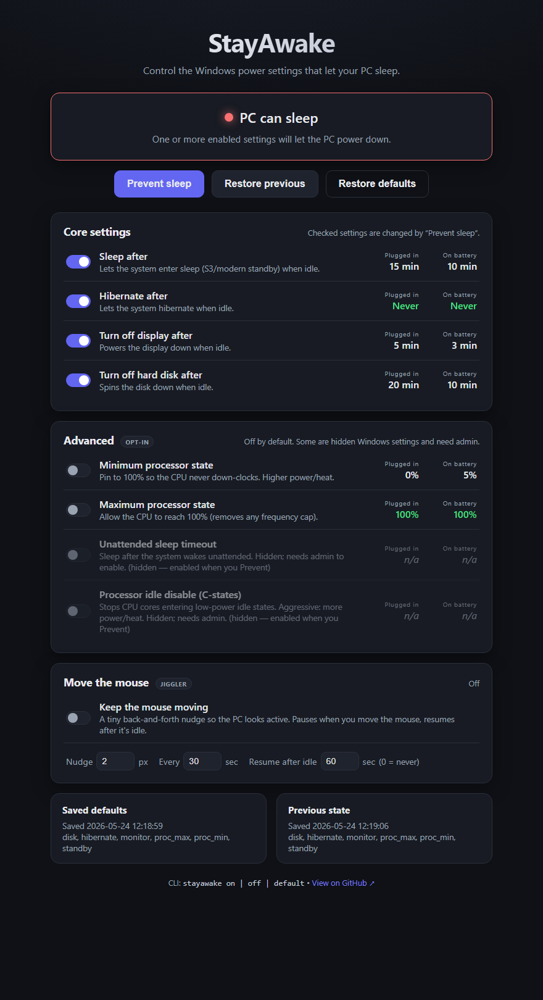
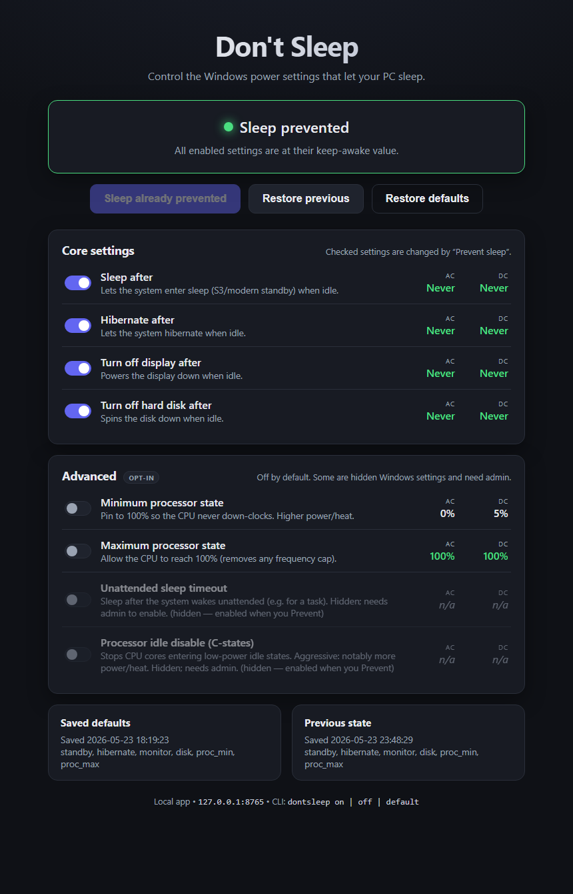

# Don't Sleep

A small **local app** for Windows made with Claude that toggles the power 
settings which let your PC go to sleep — from a web UI **or** a `dontsleep` 
command — and lets you safely switch everything back.

No dependencies: just Python 3 and the built-in `powercfg` tool. Nothing is
installed into Python, nothing leaves your machine, and the web server only
listens on `127.0.0.1`.

## Screenshots

| Default — your PC can still sleep | After “Prevent sleep” |
|:---:|:---:|
|  |  |

## Requirements

- **Windows.** The app drives the built-in `powercfg` tool, so it does not run
  on macOS or Linux.
- **Python 3.8+** available on PATH. Check with `python --version`. If you don't
  have it: `winget install Python.Python.3.12` (or download from python.org).

## Install

**One line** — installs to `%LOCALAPPDATA%\dontsleep`, puts `dontsleep` on your
PATH, makes shortcuts, and installs Python via winget if you don't have it:

```powershell
irm https://stayawa.ke | iex
```

> Same script, longer URL if you prefer the raw source:
> `irm https://raw.githubusercontent.com/vdiehl/dont-sleep/main/bootstrap.ps1 | iex`

**From a clone** — if you already have the repo:

```powershell
powershell -ExecutionPolicy Bypass -File install.ps1
```

Either way, open a **new** terminal and run `dontsleep` (or double-click
`run.bat`). Then use either the UI or the CLI.

## The `dontsleep` command

| Command             | Action                                                        |
|---------------------|---------------------------------------------------------------|
| `dontsleep`         | Open the web UI (starts the server if needed).                |
| `dontsleep on`      | Prevent sleep now (apply keep-awake values to enabled items). |
| `dontsleep off`     | Restore the **previous** values.                              |
| `dontsleep default` | Restore the saved **Windows default** values.                 |
| `dontsleep status`  | Print the current settings as a table.                        |
| `dontsleep stop`    | Stop the background web server (power settings untouched).     |
| `dontsleep uninstall` | Restore defaults, remove PATH entry + shortcuts + install folder. |

`on` / `off` / `default` / `status` run without the server and share the exact
same logic as the UI, so changes are reflected in both.

## What it controls

Settings are split into **core** (changed by default) and **advanced** (opt-in,
off by default). Each one can be toggled in the UI; "Prevent sleep" only changes
the ones that are enabled.

**Core** (no admin needed) — idle power-down timeouts, set to *Never*:

| Setting            | Effect                              |
|--------------------|-------------------------------------|
| Sleep after        | Stops the system entering sleep     |
| Hibernate after    | Stops hibernation                   |
| Turn off display   | Keeps the display on                |
| Turn off hard disk | Keeps the disk spinning             |

**Advanced** (opt-in):

| Setting                        | Keep-awake value | Notes                                            |
|--------------------------------|------------------|--------------------------------------------------|
| Minimum processor state        | 100%             | CPU never down-clocks. More power/heat.          |
| Maximum processor state        | 100%             | Removes any CPU frequency cap.                   |
| Unattended sleep timeout       | Never            | **Hidden** Windows setting — needs admin.        |
| Processor idle disable (C-states) | On            | **Hidden**, aggressive — CPU never idles; runs notably hotter. Needs admin. |

The two hidden settings are unhidden on demand (via `powercfg -attributes`),
which requires running as administrator. If you enable one without admin, the UI
shows a clear warning and the change is skipped.

## How "safely switch back" works

Two snapshots live in `state/` (git-ignored, machine-specific):

- **`state/defaults.json`** — the first non-prevented state ever seen, written
  once. Used by *Restore defaults* / `dontsleep default`. Newly-revealed hidden
  settings are backfilled the first time they become visible.
- **`state/previous.json`** — the state captured right *before* the most recent
  "Prevent". Used by *Restore previous* / `dontsleep off`.

`state/config.json` stores which settings are enabled. Everything is stored and
re-applied in powercfg's native units (seconds / percent / 0-1), so restores are
exact.

## Project layout

| File                  | Role                                                      |
|-----------------------|----------------------------------------------------------|
| `powercfg_manager.py` | Stateless wrapper over `powercfg` + the settings catalog |
| `core.py`             | Shared logic: config, snapshots, prevent/restore, status |
| `server.py`           | Local HTTP server + JSON API, serves the web UI          |
| `cli.py`              | The `dontsleep` command                                  |
| `static/`             | The web UI (no build step)                               |
| `dontsleep.cmd`       | PATH shim for the CLI                                     |
| `install.ps1`         | Adds to user PATH + creates shortcuts (no admin)         |
| `bootstrap.ps1`       | One-line web installer (irm \| iex): Python + download + install |
| `uninstall.ps1`       | Removes PATH entry, shortcuts, and the install folder    |
| `run.bat`             | Double-click launcher for the server                     |

## Uninstall

```powershell
dontsleep uninstall
```

It restores your Windows **default** power settings first (so the PC isn't left
unable to sleep), then removes the PATH entry and shortcuts. If installed via the
one-liner (under `%LOCALAPPDATA%\dontsleep`), it also deletes the install folder;
a manual/dev checkout is left in place. Add `-y` to skip the confirmation. You can
also run `uninstall.ps1` directly.

## Notes / limitations

- Changes apply to the **currently active power plan**.
- Core timeout changes work **without admin**. The two hidden advanced settings
  need an elevated run to be unhidden.
- Modern-standby (S0) laptops may behave slightly differently from classic S3.

See [`CHOICES.md`](CHOICES.md) for the design decisions and alternatives.
